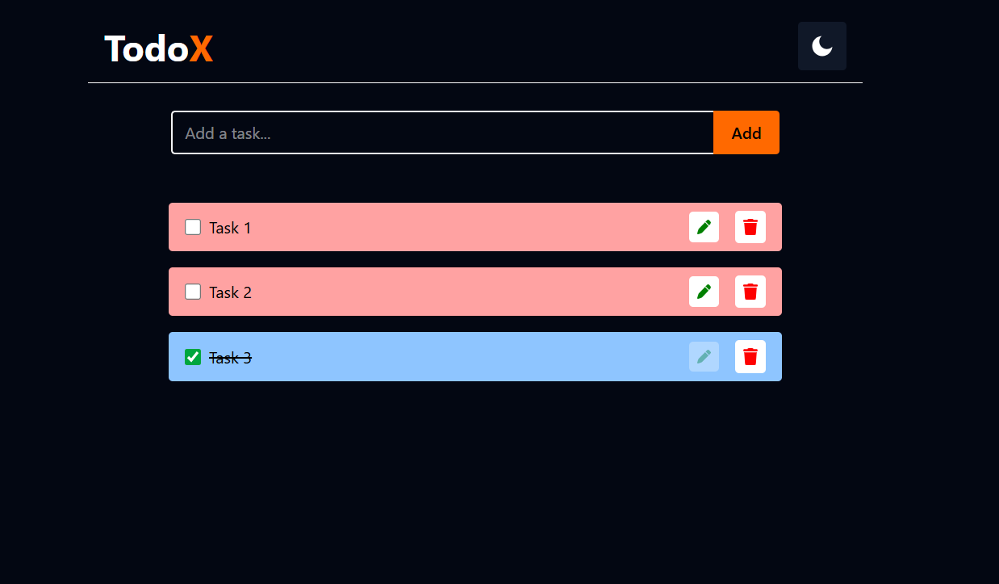

# TodoX - A Simple Todo List App  

TodoX is a sleek and minimalistic Todo List application built with ***React*, *Tailwind CSS*, *Context API*, and *LocalStorage***. It helps users efficiently manage their tasks by allowing them to add, edit, delete, and mark tasks as completed.  

## 🚀 Features  

- *Add Tasks*: Quickly add new tasks to your list.  
- *Edit Tasks*: Modify existing tasks easily.  
- *Delete Tasks*: Remove tasks that are no longer needed.  
- *Mark as Completed*: Keep track of your progress by marking tasks as completed.  
- *Dark Mode Support*: Toggle between light and dark mode for a better user experience.  
- *LocalStorage Persistence*: Your tasks are stored locally, so they remain intact even after refreshing the page.  

## 🛠 Tech Stack  

- *Frontend*: React.js  
- *Styling*: Tailwind CSS  
- *State Management*: Context API  
- *Storage*: LocalStorage  

## 📸 Screenshots  



## 🏗 Installation  

1. Clone the repository:  
   ```sh
   git clone https://github.com/your-username/todox.git
   cd todox
2. ```sh
    npm install
3. ```sh
    npm run dev    
    